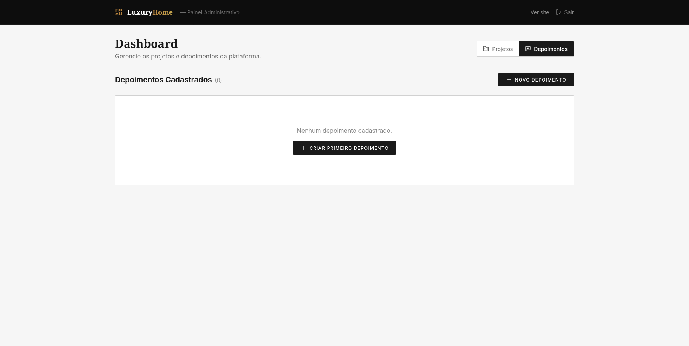
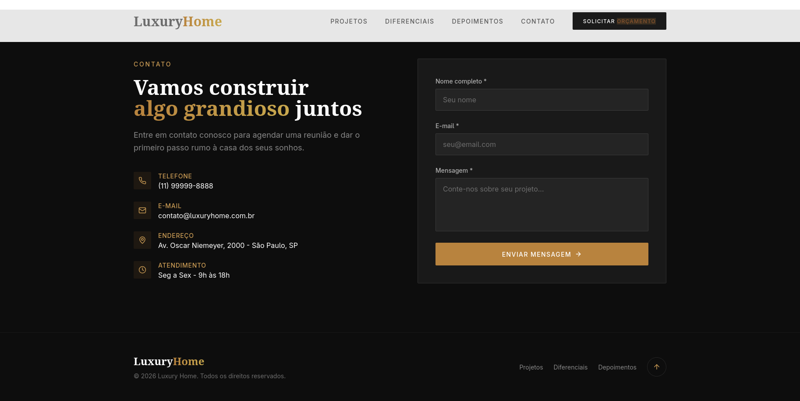

# 🏡 Luxury Construction

> Uma plataforma Full Stack para construtoras de alto padrão, composta por uma Landing Page moderna e um painel administrativo completo para gerenciamento de projetos e depoimentos.

---

## 📸 Preview


---

## Painel Administrativo



---

## Contatos



---

## ✨ Funcionalidades

### Landing Page

- Hero Section moderna
- Design totalmente responsivo
- Navegação suave entre seções
- Galeria de projetos
- Modal com detalhes dos projetos
- Carrossel de depoimentos
- Formulário de contato
- Envio de e-mails via SMTP
- SEO otimizado

---

### Painel Administrativo

- Login protegido por JWT
- CRUD completo de Projetos
- CRUD completo de Depoimentos
- Paginação
- Atualização em tempo real utilizando React Query
- Validação completa dos formulários
- Proteção das rotas administrativas

---

## 🚀 Tecnologias

### Front-end

- Next.js 14
- React 18
- TypeScript
- Tailwind CSS
- Framer Motion
- React Hook Form

### Back-end

- Next.js Route Handlers
- Prisma ORM
- PostgreSQL
- JWT Authentication
- Zod
- Nodemailer

### Ferramentas

- React Query
- ESLint
- TypeScript Strict Mode

---

## 🏗 Arquitetura

```
src/
 ├── app/
 ├── components/
 ├── lib/
 ├── types/
 ├── api/
 └── admin/
```

O projeto foi desenvolvido utilizando a arquitetura do **Next.js App Router**, separando responsabilidades entre interface, lógica de negócio, autenticação, banco de dados e APIs.

---

## 🔒 Segurança

- JWT Authentication
- Cookies HttpOnly
- Middleware protegendo rotas administrativas
- Validação de dados com Zod
- Hash de senha
- APIs protegidas

---

## 📦 Banco de Dados

O projeto utiliza:

- PostgreSQL
- Prisma ORM

Modelos principais:

- Projects
- Testimonials

---

## 📩 Contato

O formulário envia mensagens utilizando SMTP através do Nodemailer.

---

## ⚙️ Instalação

Clone o projeto

```bash
git clone https://github.com/seuusuario/luxury-construction.git
```

Entre na pasta

```bash
cd luxury-construction
```

Instale as dependências

```bash
npm install
```

Configure o arquivo `.env`

```env
DATABASE_URL=

JWT_SECRET=

ADMIN_PASSWORD=

SMTP_HOST=
SMTP_PORT=
SMTP_USER=
SMTP_PASS=

CONTACT_EMAIL_TO=
CONTACT_EMAIL_FROM=
```

Execute as migrations

```bash
npx prisma migrate dev
```

Inicie o projeto

```bash
npm run dev
```

---

## 🖥 Painel Administrativo

```
/admin/login
```

Após autenticação é possível:

- Criar projetos
- Editar projetos
- Excluir projetos
- Gerenciar depoimentos

---

## 🎯 Objetivos do Projeto

Este projeto foi desenvolvido para demonstrar conhecimentos em:

- Arquitetura Full Stack
- Next.js App Router
- APIs REST
- Autenticação
- PostgreSQL
- Prisma ORM
- React Query
- Validação
- UX/UI moderna
- Responsividade
- Organização de código

---

## 📄 Licença

Este projeto foi desenvolvido apenas para fins de estudo e portfólio.
